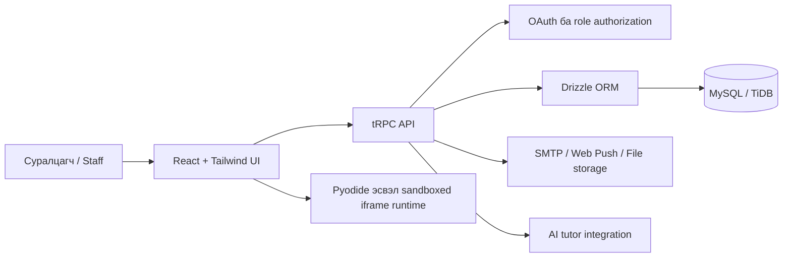

# CodeCraft Academy

> **Монгол хэл дээрх Python, HTML, CSS, JavaScript сургалтын платформ.** Суралцагч интерактив хичээл, онлайн кодын орчин, AI туслах, шалгалт, төсөл, тэмдэг, сертификат ашиглан бодит ахицаа хадгалж сурна.

Энэ repository нь CodeCraft Academy-ийн frontend, backend, өгөгдлийн загвар, тест, Mongolian operational documentation-ийг агуулна. Одоогийн бодлогоор **Python, HTML, CSS, JavaScript** дөрвөн чиглэл нь суралцагчдад бүрэн үнэгүй нээлттэй. Дараа нэмэх бусад програмчлалын хэлүүдийг төлбөртэй каталогт тусад нь харуулдаг боловч төлбөрийн систем хараахан идэвхжээгүй тул худалдан авалтын хоосон урсгал байхгүй.

## Requested HTML/CSS/JavaScript + Python/FastAPI + Supabase stack

The framework-free migration is available in `frontend/`, `backend/`, and `supabase/`. The new entry points are `frontend/index.html`, `frontend/assets/css/styles.css`, `frontend/assets/js/app.js`, `backend/app/main.py`, and `supabase/migrations/001_codecraft_core.sql`. The existing TypeScript application remains in `client/`, `server/`, `shared/`, and `drizzle/` so the legacy behavior can be compared or migrated feature by feature without an uncontrolled destructive rewrite.

```bash
# Terminal 1: FastAPI
cd backend
python3 -m venv .venv
source .venv/bin/activate
pip install -r requirements.txt
cp .env.example .env
uvicorn app.main:app --reload --port 8000

# Terminal 2: vanilla frontend
cd frontend
python3 -m http.server 5500
```

Apply `supabase/migrations/001_codecraft_core.sql` in the Supabase SQL Editor, then set the public URL and anon key in `frontend/config.js`. Keep `SUPABASE_SERVICE_ROLE_KEY` only in `backend/.env`; never expose or commit it.

## 1. Платформыг хэрхэн ашиглах вэ?

Эхлээд нүүр хуудасны **“Нэвтрэх”** үйлдлээр нэвтэрнэ. Нэвтэрсний дараа сонгосон хичээл, явц, шалгалтын оролдлого, төсөл, тэмдэг, мэдэгдэл нь таны бүртгэлд хадгалагдана. Нүүр хуудасны дөрвөн үнэгүй курсийн карт бүр хөтөлбөр, кодын орчин, төсөл, шалгалт руу шууд холбогддог.

| Хэрэглэгчийн зорилго | Хаанаас орох вэ? | Юу хийх вэ? |
|---|---|---|
| Хичээл сонгох | `/` эсвэл `/curriculum` | Python, HTML, CSS, JavaScript сургалтын шат, хичээл, нээгдэх дарааллыг харах |
| Код бичиж турших | `/workspace?course=<courseId>` | Код бичих, ажиллуулах, гаралт/алдааг харах, AI туслахаас чиглэл авах |
| Шалгалт өгөх | `/quiz/:courseId/:lessonId` | Олон асуултад хариулж, тайлбар ба хадгалагдсан оноогоо харах |
| Баримт унших | `/library` | Хичээлтэй холбоотой PDF баримтыг дотроос нь унших, шаардлагатай үед браузераар нээх |
| Төсөл илгээх | `/projects/:courseId` | Repository URL, live URL, тайлбар, файл хавсаргалттайгаар төсөл илгээх |
| Профайл, амжилт харах | `/profile` | Дэлгэцийн нэр, ахиц, badge, сертификат, profile QR code-оо удирдах |
| Мэдэгдэл удирдах | `/notifications` | Хичээл, шалгалт, төслийн мэдэгдэл болон email/push сонголтоо тохируулах |

### 1.1 Дөрвөн үнэгүй кодын лаборатори

**Python** нь Pyodide-д суурилсан browser runtime ашигладаг тул `print` гаралт болон Python runtime алдааг кодын орчинд шууд харуулна. **HTML, CSS, JavaScript** нь sandboxed iframe дотор тусдаа ажиллана. JavaScript-ийн `console.log` болон exception-ууд output panel-д харагдана. Editor-ийн гаралт нь тухайн preview session-д локал байх боловч суралцах ахиц, шалгалтын үр дүн, badge, сертификат нь нэвтэрсэн хэрэглэгчийн database-д хадгалагдана.

AI туслах руу асуулт илгээхдээ одоогийн курс, хичээлийн гарчиг, таны асуулт, бичиж буй код хамгаалагдсан server procedure-р дамжин очно. Туслах нь Монгол хэлээр тайлбар, нэг чиглүүлэх hint, дараагийн жижиг алхмыг өгдөг; таны кодыг асуулт илгээхээс өмнө автоматаар гадагш дамжуулдаггүй.

### 1.2 Шалгалт, төсөл, сертификат

Шалгалт нь олон асуулттай бөгөөд илгээсний дараа оноо, зөв хариултын тайлбар, хадгалагдсан оролдлогыг үзүүлнэ. Төслийн хэсэг нь file attachment, version history, хувилбаруудын diff, rubric-аар үнэлгээ, багшийн санал хүсэлтийг дэмжинэ. Шаардлага хангасан суралцагч сертификат болон badge авна. Сертификатын share card дээрх QR code нь таны нийтэд нээлттэй profile хуудас руу холбогдоно.

## 2. Багш, шалгагч, эзэмшигчийн ашиглалт

Staff хэсэг нь `/teacher`, owner operations workspace нь `/teacher/operations` route дээр байрлана. Бүх эрхийг server талд шалгадаг; зөвхөн UI-д нуух зарчмаар хамгаалдаггүй.

| Дүр | Зориулалт | Гол үйлдлүүд |
|---|---|---|
| `user` | Суралцагч | Хичээл, кодын орчин, quiz, төсөл, profile, notification ашиглах |
| `reviewer` | Шалгагч | Төсөл харах, rubric-аар үнэлэх, feedback өгөх |
| `teacher` | Багш | Суралцагчийн ахиц, quiz, project review, rubric ашиглах, хичээлийн удирдлагын эрх |
| `admin` | Админ | Owner-той адил хамгаалагдсан удирдлагын эрхийн compatibility role |
| `owner` | Платформ эзэмшигч | Audit log, staff invitation, rubric import/export, operations analytics, role management |

Owner нь шинэ reviewer эсвэл teacher-д урилга үүсгэж, дахин цуцалж, нэг удаагийн 7 хоногийн хүчинтэй hashed token бүхий invitation link илгээж чадна. Invitation email нь configured SMTP transport ашиглаж, plain-text fallback-тай branded HTML байдлаар явна. Audit log-д нууц утга хадгалахгүй; owner action type болон хугацаагаар шүүж харна.

## 3. Системийг хэрхэн хийсэн бэ?

CodeCraft Academy нь нэг TypeScript full-stack project юм. Frontend нь React 19 ба Tailwind CSS 4, API layer нь tRPC 11, server нь Express 4, persistence нь Drizzle ORM ба MySQL/TiDB дээр ажиллана. Authentication нь Manus OAuth session flow ашигладаг. Client нь HTTP API-г гараар дуудахгүй; type-safe tRPC query/mutation contract ашиглана.



Хөгжүүлэлтийн үндсэн дараалал нь: **(1)** schema-г `drizzle/schema.ts` дээр тодорхойлох, **(2)** database helper-ийг `server/db.ts` дээр нэмэх, **(3)** permission-тэй tRPC procedure-г `server/routers.ts` дээр нэмэх, **(4)** React UI-г route дээр холбох, **(5)** Vitest regression test-ээр баталгаажуулах явдал юм.

## 4. Folder болон гол file-ууд

Repository-д нууц `.env`, dependency folder, build output, log, local IDE file-ууд орохгүй. Харин ажиллахад шаардлагатай source, schema, lockfile, тест, Markdown documentation бүгд version control-д орно.

```text
codecraft-academy/
├── client/
│   ├── src/
│   │   ├── pages/                 # Нүүр, хөтөлбөр, workspace, quiz, profile, staff routes
│   │   ├── components/            # DashboardLayout, AIChatBox, shadcn/ui primitives
│   │   ├── hooks/                 # Mobile viewport болон UI hooks
│   │   ├── lib/                   # tRPC client, QR/achievement utilities
│   │   ├── App.tsx                # Wouter route map
│   │   └── index.css              # CodeCraft typography, color, focus, responsive tokens
│   └── public/                    # Зөвхөн жижиг runtime configuration file
├── server/
│   ├── _core/                     # OAuth, tRPC bootstrap, server infrastructure
│   ├── db.ts                      # Database query/helper layer
│   ├── routers.ts                 # Protected/public tRPC procedures
│   ├── notificationDelivery.ts    # SMTP, push delivery helpers
│   └── *.test.ts(x)               # 19 Vitest regression suite
├── drizzle/
│   ├── schema.ts                  # MySQL/TiDB table, relation, type definitions
│   └── migrations/                # Schema migration history
├── shared/                        # Curriculum constants болон shared types
├── docs/                          # Functional contracts ба QA notes
├── LOCAL_ENV_SETUP.md             # Safe local environment guide
├── DESIGN_DIRECTION.md            # Learning-lab visual system
├── REFERENCE_PATTERN_NOTES.md     # W3Schools, 1234.mn adaptation notes
├── package.json                   # Script, dependency definitions
├── pnpm-lock.yaml                 # Reproducible dependency versions
└── todo.md                        # Feature history and completion tracking
```

| File / folder | Хариуцлага |
|---|---|
| `client/src/App.tsx` | Нүүр, curriculum, workspace, quiz, library, profile, projects, notifications, teacher, operations, invitation routes |
| `client/src/pages/Home.tsx` | Үнэгүй дөрвөн курсийн discovery, paid future-language policy, learner entry points |
| `client/src/pages/Workspace.tsx` | Python/HTML/CSS/JavaScript editor, preview/output, AI tutor UI |
| `client/src/components/DashboardLayout.tsx` | Staff desktop sidebar, 375px mobile dropdown navigation, user session UI |
| `server/routers.ts` | Authorization boundary болон browser-to-server contract |
| `server/db.ts` | Dashboard, progress, quiz, project, invitation, analytics database access |
| `drizzle/schema.ts` | User/role, progress, badge, certificate, quiz, project, notification, audit, invitation tables |
| `server/*.test.ts(x)` | Auth, runtime, tutor, quiz, route, teacher, accessibility, notification regressions |

## 5. Өгөгдөл яаж хадгалагддаг вэ?

| Data domain | Гол table-ууд | Тайлбар |
|---|---|---|
| Хэрэглэгч ба эрх | `users` | OAuth `openId`, дэлгэцийн нэр, email, `user/reviewer/teacher/admin/owner` role |
| Ахиц ба амжилт | `course_progress`, `badge_definitions`, `learner_badges`, `certificates` | Хичээлийн ахиц, badge grant, verification code-той сертификат |
| Шалгалт ба төсөл | `quiz_attempts`, `project_submissions`, `project_submission_versions`, `project_attachments`, `rubric_templates` | Quiz score, rubric assessment, file metadata, version history/diff |
| Мэдэгдэл | `notification_preferences`, `learner_notifications`, `push_subscriptions`, `notification_deliveries` | In-app, email, browser push preference болон delivery record |
| Үйл ажиллагааны хяналт | `audit_logs`, `staff_invitations`, `onboarding_progress` | Owner audit, secure invitation token hash, role-aware onboarding state |

Файл нь database-ийн BLOB column-д хадгалагддаггүй. File attachment нь storage key, URL, MIME type, хэмжээ, preview type зэрэг metadata-г database-д хадгалж, byte content-ийг object storage-д байлгадаг.

## 6. Локал компьютер дээр ажиллуулах

Эхлээд Node.js 22+ болон pnpm суусан байх шаардлагатай. Нууц утгуудыг repository-д бичиж, commit хийж болохгүй. `LOCAL_ENV_SETUP.md` нь placeholder-only `.env` template, Gmail App Password, VAPID key, database connection, troubleshooting хэсгийг агуулна.

```bash
git clone https://github.com/ZERO1zx1/Website.git codecraft-academy
cd codecraft-academy
pnpm install

# LOCAL_ENV_SETUP.md-г дагаж локал .env тохируулна.
pnpm db:push
pnpm dev
```

Local development server-ийн default port нь `3000`. Local database connection болон OAuth callback URL-уудыг таны өөрийн environment-д тохируулна. Production credential, Gmail App Password, VAPID private key, JWT secret, database password зэргийг GitHub repository-д хэзээ ч commit хийхгүй.

### 6.1 Environment variable-ийн ангилал

| Ангилал | Жишээ нэр | Зориулалт |
|---|---|---|
| Database | `DATABASE_URL` | MySQL/TiDB connection |
| Session/Auth | `JWT_SECRET`, `VITE_APP_ID`, `OAUTH_SERVER_URL`, `VITE_OAUTH_PORTAL_URL` | OAuth болон session security |
| Owner | `OWNER_OPEN_ID`, `OWNER_NAME` | Owner-level authorization bootstrap |
| AI / storage | `BUILT_IN_FORGE_API_URL`, `BUILT_IN_FORGE_API_KEY` | Server-side integrated services |
| Email | `GMAIL_SMTP_USER`, `GMAIL_SMTP_APP_PASSWORD` | Invitation болон opt-in notification email |
| Browser push | `VAPID_PUBLIC_KEY`, `VAPID_PRIVATE_KEY`, `VAPID_SUBJECT` | Push subscription болон delivery |

## 7. Build, test, deploy commands

| Command | Зориулалт |
|---|---|
| `pnpm dev` | Development server асаах |
| `pnpm check` | TypeScript type error шалгах |
| `pnpm test` | Vitest regression suite ажиллуулах |
| `pnpm build` | Production frontend + server bundle үүсгэх |
| `pnpm start` | `dist/` production bundle ажиллуулах |
| `pnpm db:push` | Drizzle schema migration generation ба migration ажиллуулах |

Энэ checkpoint-д `pnpm check` болон `pnpm test` амжилттай ажилласан; **19 test file, 60 test** ногоон гарсан. Хөгжүүлэлт хийсний дараа дор хаяж `pnpm check && pnpm test` ажиллуулж, schema өөрчилсөн бол migration SQL-ийг шалгаж database-д хэрэглэх ёстой.

## 8. GitHub руу аюулгүй push хийх зарчим

`.gitignore` нь `node_modules`, `dist`, `.env*`, лог, coverage, temporary file, generated local configuration зэрэг repository-д орох ёсгүй зүйлсийг хасдаг. Push хийхээс өмнө дараахыг шалгана.

```bash
git status --short
git diff -- .gitignore
git grep -nE 'BEGIN (RSA |OPENSSH )?PRIVATE KEY|GMAIL_SMTP_APP_PASSWORD=.+[^_]' || true
pnpm check && pnpm test
```

Repository public болсон тохиолдолд ч гэсэн source code, documentation, lockfile, migration, tests-ийг push хийж болно. Харин production `.env`, real OAuth token, database URL, SMTP password, VAPID private key, API key, user-export data-г оруулахгүй.

## 9. Цаашдын хэрэгжүүлэх ажлууд

Төлбөртэй хэлний курсийг бодитоор нээхээс өмнө эхний санал болгох хэлүүд, үнэ, Монгол төгрөгийн billing policy, refund policy, course unlock rule-ээ тодорхойлох хэрэгтэй. Дараа нь Stripe integration, payment status table, entitlement check, owner sales dashboard, invoice/receipt communication-ийг тусдаа хамгаалагдсан scope-оор хэрэгжүүлнэ.

## Reference files

- [Local environment тохиргоо](./LOCAL_ENV_SETUP.md)
- [Code workspace functional contract](./docs/workspace-contract.md)
- [Visual direction](./DESIGN_DIRECTION.md)
- [Learning navigation research note](./REFERENCE_PATTERN_NOTES.md)
- [Responsive QA note](./docs/learning-management-responsive-qa.md)
