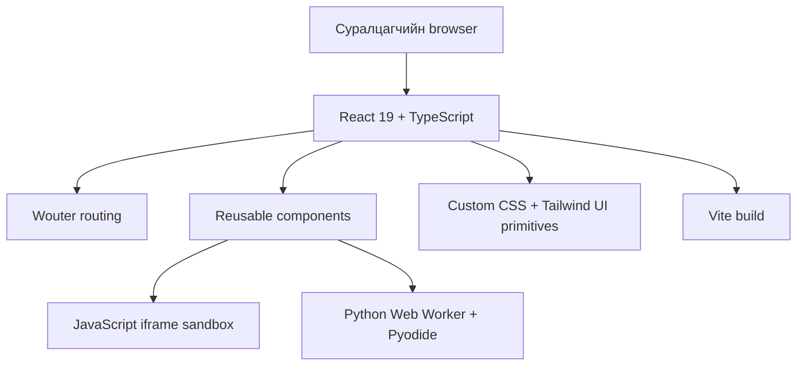
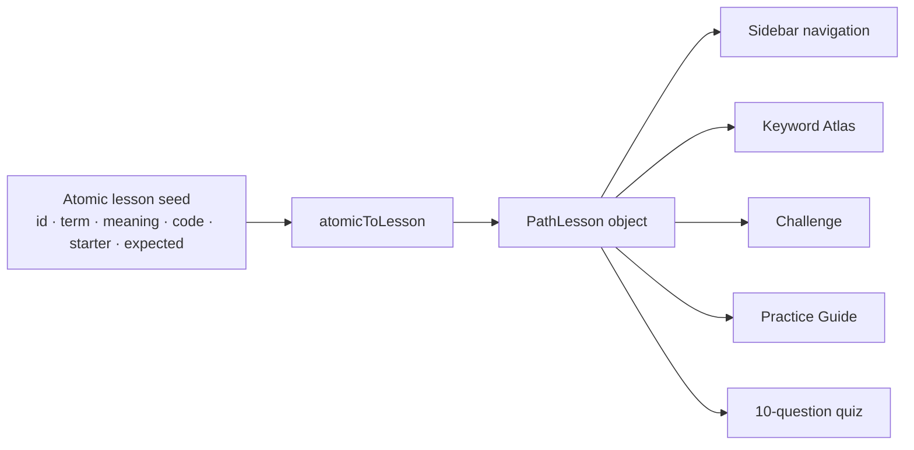
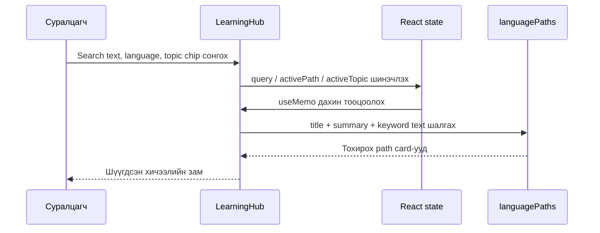
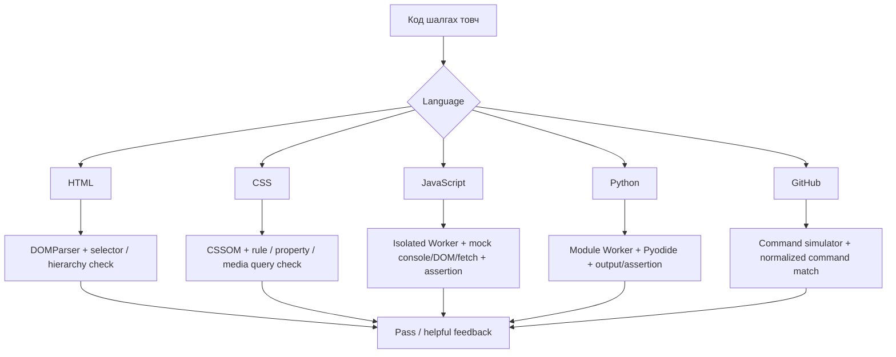
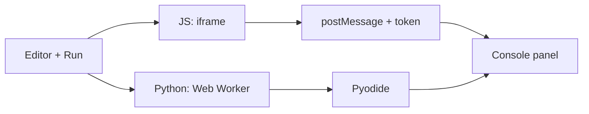
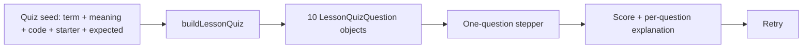
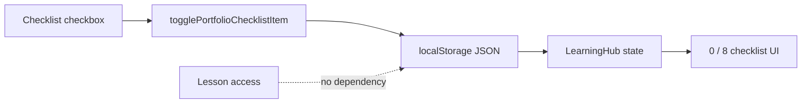

# CodeCraft Academy — Website Structure & Code Flow

## Deck direction

**Audience:** Website owner, developer, and instructor.  
**Language:** Mongolian, with common technical terms preserved in English.  
**Format:** 16:9, editable PowerPoint for Canva import.  
**Visual system:** Code Atlas Editorial — ivory paper, ink navy, atlas teal, orange/blue/yellow/green/purple language accents, Source Serif headings, IBM Plex Mono labels.  
**Cover visual:** `/home/ubuntu/codecraft-slide-assets/code-editor-workspace.png` cropped on the right, dark transparent overlay; no stock image used on technical slides.  
**Important message:** The learner-facing website is frontend-only. There is no login, database call, shared progress, XP, prerequisite lock, or learner tracking request. All lessons are directly open.

---

## Slide 1 — CodeCraft Academy

**Title:** CodeCraft Academy  
**Subtitle:** Үнэгүй frontend сургалтын website-ийн бүтэц ба code хэрхэн ажилладаг нь  
**Kicker:** ARCHITECTURE WALKTHROUGH · 2026  

**Visual:** Full-bleed right-side code-editor workspace asset. Left half is ivory with a large emerald italic word “CodeCraft”. Fine-line route map runs across the bottom.

**Speaker note:** Энэ deck нь CodeCraft Academy-ийн route, lesson data, exercise validator, JavaScript/Python sandbox, 10-question quiz, local portfolio checklist болон quality checks-ийг тайлбарлана.

---

## Slide 2 — Ямар асуудал шийдэж байна вэ?

**Headline:** Нэг page дээр холилдсон хичээл биш. Таван тусдаа кодын зам.  

| Learner хэрэгцээ | CodeCraft шийдэл |
|---|---|
| Хэл бүрийг тусад нь сурах | HTML, CSS, JavaScript, Python, GitHub гэсэн 5 path |
| Tag / property / keyword-г ойлгох | Нэг ойлголт = нэг atomic lesson |
| Зөвхөн унших биш, хийх | Code example → quest → sandbox → 10-question quiz |
| Нэвтрэлт, төлбөргүй эхлэх | Бүх lesson шууд нээлттэй |
| Бодит эх сурвалжтай сурах | Lesson бүрийн sidebar болон Practice Guide-д official source link |

**Visual:** Five vertical, color-coded path cards: HTML orange, CSS blue, JavaScript yellow, Python green, GitHub purple.

**Speaker note:** Одоогийн website нь 5 path × 24 atomic lesson буюу 120 lesson-оор ажиллаж байна. XP болон progress нь deliberate байдлаар хасагдсан.

---

## Slide 3 — Technology Stack

**Headline:** Browser-д ажиллах, component-based frontend.  

**Architecture layers:**



**Callouts:**
- **JSX** нь HTML-like UI structure-ийг React component дотор бичих хэлбэр юм.
- **TypeScript** нь props, lesson data, quiz question object зэрэг бүтэц алдах эрсдэлийг build хийхээс өмнө шалгана.
- **CSS** нь Code Atlas Editorial visual system болон responsive layout-ийг хариуцна.
- **Python** нь website server биш; суралцагчийн Python code browser дотор тусгаарлагдан ажиллана.

**Speaker note:** `client/src/main.tsx` нь `createRoot(...).render(<App />)` гэж application-ийг browser DOM-д холбоно.

---

## Slide 4 — Route Map: Хэрэглэгч хаашаа явдаг вэ?

**Headline:** Богино, public routing.  

```mermaid
flowchart LR
  A[/  эсвэл /learn/] --> B[LearningHub]
  B --> C{Search / language / topic filter}
  C --> D[5 course card]
  D --> E[/learn/:language/:lesson]
  E --> F[FreePathLesson]
  F --> G[Example + Quest + Practice Guide + 10-question Quiz]
  E --> H[Өмнөх / дараах lesson]
```

**Route table:**

| URL | Component | Үүрэг |
|---|---|---|
| `/` болон `/learn` | `LearningHub` | Course discovery, filter, portfolio checklist |
| `/learn/:language/:lesson` | `FreePathLesson` | Нэг lesson-ийн detail, exercise, quiz |
| `/404` | `NotFound` | Буруу link-ийн fallback |

**Speaker note:** Wouter-ийн `Route` болон `Switch` нь URL-г component-д холбоно. URL parameter-аас language/lesson-г уншиж зөв data-г сонгодог.

---

## Slide 5 — Curriculum Data: 120 Lesson хэрхэн үүсдэг вэ?

**Headline:** Data-first curriculum — UI-ийг хуулж давтахгүй.  



**Lesson object-ийн гол талбарууд:**
- `title`, `summary`, `keywords`, `code` — унших хэсэг.
- `challenge` — starter code, validator requirement, hint, timed/debug/predict/build mode.
- `quiz` — 10 асуултын object array.
- `source`, `sourceLabel` — path-level official reference.

**Evidence:** `client/src/lib/curriculumData.ts`, `client/src/lib/githubCurriculum.ts`.

**Speaker note:** HTML/CSS/JavaScript/Python-ийн atomic seed-үүд `atomicToLesson()` функцээр нэг contract руу ордог. GitHub нь `gitLesson()` builder ашигладаг ч ижил `PathLesson` object буцаадаг.

---

## Slide 6 — Нүүр хуудасны Search & Filter Flow

**Headline:** Хайлт бол browser state + curriculum data-ийн шүүлт.  



**Filters:** Free-text search; HTML/CSS/JavaScript/Python/GitHub language chips; Semantic HTML, Layout & UI, Browser logic, Python data, Git workflow topic chips.

**Speaker note:** Энэ flow-д API call байхгүй. `useState`, `useMemo`, `languagePaths` гэсэн frontend data-аар шууд ажиллана.

---

## Slide 7 — Lesson Page-ийн Anatomy

**Headline:** Нэг lesson = ойлголт → туршилт → тайлбар → шалгалт.  

**Vertical page map:**

1. **Sidebar** — Course source link + бүх 24 lesson navigation; mobile дээр эвхэгддэг.
2. **Lesson Hero** — Lesson number, title, short summary, keyword count.
3. **Keyword Atlas** — Tag/property/command бүрийн товч тайлбар.
4. **Read the Code** — Example code.
5. **Quest** — Build / debug / predict / timed interaction.
6. **Run + Observe** — JavaScript/Python lab (хамаарах lesson дээр).
7. **Practice Guide** — Safe boundary, automated check, real-world next step, source link.
8. **10-question Quiz** — One question at a time; explanation-rich review.

**Visual:** Editorial vertical spine with 8 numbered nodes; use the language accent of the slide as a gradient on the left.

---

## Slide 8 — Challenge Validation: Ямар code-г яаж шалгадаг вэ?

**Headline:** String хайх биш, language-specific behavior шалгана.  



**Safety message:** Learner code нь server рүү илгээгдэхгүй. GitHub quest нь repository, token, network ашиглахгүй command simulator юм.

**Evidence:** `client/src/components/LessonChallenge.tsx`.

---

## Slide 9 — Interactive Sandbox: JavaScript ба Python

**Headline:** Browser доторх хоёр өөр тусгаарлагдсан execution path.  

| JavaScript lab | Python lab |
|---|---|
| Editor code → sandboxed iframe document | Editor code → module Web Worker |
| `postMessage` дээр random token шалгана | Worker message дээр run id шалгана |
| Console / error output parent UI-д буцна | Pyodide runtime output / error UI-д буцна |
| Iframe-д `allow-scripts` л зөвшөөрнө | Main UI freeze болохоос worker тусгаарлана |



**Speaker note:** `CodeSandbox.tsx` нь JS-д `srcDoc` үүсгэн iframe mount хийдэг; Python-д worker-г lazily үүсгэж message дамжуулдаг. Error болон reset UI тусдаа state-тэй.

---

## Slide 10 — 10-Question Quiz Engine

**Headline:** Нэг lesson-ийн ойлголтыг 10 өөр өнцгөөс шалгана.  

**Question types:**

| # | Kind | Learner юу хийдэг вэ? |
|---:|---|---|
| 1–2 | Concept / Keyword | Зөв тайлбар, гол ойлголтыг сонгоно |
| 3 | Output prediction | Code snippet-ийг ажиглаж, хэрэгжсэн ойлголтыг сонгоно |
| 4 | Debug diagnosis | Starter code-ийн requirement-ийг тодорхойлно |
| 5, 8 | Build requirement | Зөв хэрэгжүүлэх алхам, validator requirement-ийг танина |
| 6–7 | Code review / Meaning match | Зориулалт ба review decision-ийг шалгана |
| 9–10 | Practice / Source awareness | Бодит project ба official reference рүү холбож бодно |



**Evidence:** `client/src/lib/curriculumQuiz.ts`, `client/src/components/LessonQuiz.tsx`.

---

## Slide 11 — Local State ба Free Learning Boundary

**Headline:** Хичээл үзэх эрхийг ямар ч data хязгаарлахгүй.  

**What is deliberately absent:** Login, account, database, tRPC call, shared progress, XP, prerequisite lock, certificate eligibility, learner tracking request.

**What remains local:** GitHub Portfolio Checklist-ийн сонгосон item ID-ууд л `localStorage` JSON-д хадгалагдана. Энэ нь optional, browser-specific бөгөөд course access-д нөлөөлөхгүй.



**Speaker note:** Browser data-г цэвэрлэвэл checklist тэмдэглэл арилж болно. Харин lesson бүр URL-ээр шууд нээгдэнэ.

---

## Slide 12 — Quality Gate & Demo Checklist

**Headline:** Хөгжүүлэлт нь зөвхөн харагдах байдлаар дуусдаггүй.  

**Validation stack:**

| Layer | Баталгаажуулалт |
|---|---|
| Static types | `tsc --noEmit` |
| Unit & interaction | Vitest — 20 test file, 48 test |
| Key behaviors | 5 path, 24+ lesson/path, 10-question quiz, filter, all-lesson access, sandbox contracts |
| Build | Vite production bundle + server bundle |
| UX | Desktop ба mobile screenshot review |

**Live demo order:**

1. Нүүр хуудаснаас “Git workflow” topic chip дарж filter харуул.
2. JavaScript эсвэл Python lesson нээгээд code editor, sandbox boundary тайлбарла.
3. Quest-ийн code check харуул.
4. 10-question quiz-ийн 1/10 → result/review → retry flow харуул.
5. GitHub portfolio checklist-ийн optional local тэмдэглэлийг харуул.

**Closing line:** “CodeCraft Academy бол backend-тэй LMS биш; browser-д шууд ажилладаг, эх сурвалжтай, code-first чөлөөт сургалтын төв юм.”
